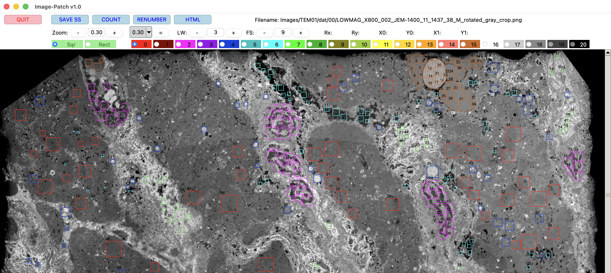

# Image-patch
**Extract labeled rectangular regions**

Image-patch is a graphical application that enables users to crop rectangular regions from images, 
categorize each crop with user-defined labels, 
and systematically store the resulting labeled data for use in machine learning training workflows.

## Screenshot

<kbd></kbd>

Screenshot using an image from [Takeda et al. (2020)](https://doi.org/10.1136/jclinpath-2020-206801).

## Command line usage
```
% image_patch.py image-filename output-directoryname 
```

## Cropping with mouse interaction
Drag the mouse to select a rectangular region. Rectangular regions can be selected as either squares or rectangles ("Sqr" or "Rect").
